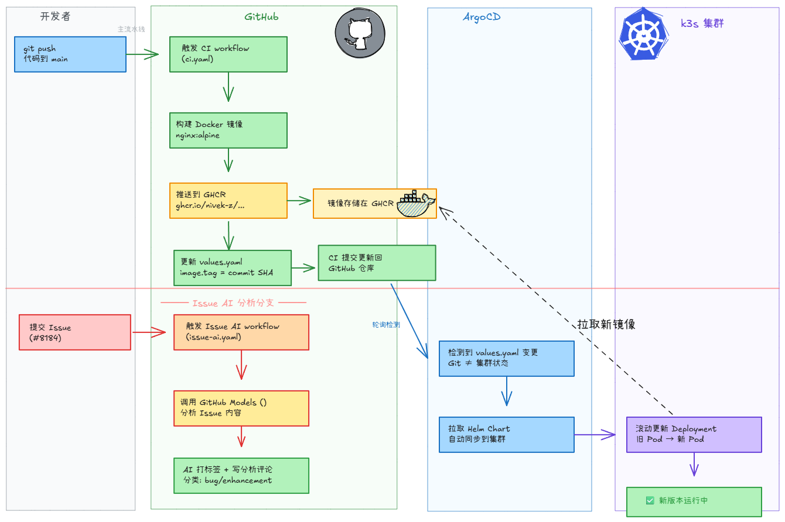

# 组会报告：CI/CD · DevOps · GitOps 概念与实践

> 参考：GitLab - [What is GitOps?](https://about.gitlab.com/topics/gitops/)

---

## 一、为什么需要这些？

### 传统开发的痛点

```
开发写完代码 ──→ 扔给运维 ──→ 运维部署

问题：
  ❌ 环境不一致
  ❌ 手动部署易出错
  ❌ 发布周期长（周/月级）
  ❌ 回滚困难
  ❌ 缺乏审计 tracking
```

### 核心理念

> **把基础设施和部署当作软件工程来做**——用代码管理一切，自动化一切。

---

## 二、DevOps — 文化与哲学

**DevOps** = Development + Operations 的结合，是一种**文化、理念和协作方式**，而非单一工具。

### 核心目标

| 目标 | 说明 |
|------|------|
| 缩短交付周期 | 从代码提交到上线的时长 |
| 提高部署频率 | 从月级 → 周级 → 天级 → 多次/天 |
| 降低故障率 | 自动化减少人为失误 |
| 快速恢复 | 出问题能快速回滚或修复 |

### 三大支柱

```
         ┌─────────────────────────────┐
         │         DevOps              │
         ├──────────┬────────┬─────────┤
         │  流程     │  工具   │  文化   │
         │ 自动化    │ CI/CD  │ 协作共  │
         │ 持续交付  │ 容器化  │ 担责任  │
         └──────────┴────────┴─────────┘
```

---

## 三、CI/CD — 实践与抓手

### CI（Continuous Integration，持续集成）

```
频繁合并代码 → 自动构建 → 自动测试 → 快速反馈
                ↑
         质量门禁（lint、测试、安全扫描）
```

### CD（Continuous Deployment / Delivery，持续部署）

```
CI 通过后 → 自动部署到目标环境
```

| 模式 | 说明 |
|------|------|
| Continuous **Delivery** | 自动构建，人工确认部署 |
| Continuous **Deployment** | 全自动，CI 通过直接上线 |

### 通用流水线模型

```
代码提交 → Lint → 单元测试 → 构建镜像 → 集成测试 →
推送制品库 → 部署测试环境 → E2E 测试 → 部署生产
```

---

## 四、GitOps — 定义（参考 GitLab）

> 根据 [GitLab 官方定义](https://about.gitlab.com/topics/gitops/)，**GitOps 是一种将 DevOps 最佳实践（版本控制、协作、合规、CI/CD）应用于基础设施自动化的操作框架**。

### GitLab 给出的三大核心组件

```
┌─────────────────────────────────────────────────────────┐
│              GitOps 三大核心组件                          │
│                                                         │
│  ① 基础设施即代码 (IaC)                                  │
│     Git 仓库作为基础设施定义的唯一真相源                   │
│     (Single Source of Truth)                             │
│                                                         │
│  ② Merge Request / Pull Request                         │
│     所有基础设施变更都通过 MR/PR 进行                     │
│     审核、批准、记录，形成完整的审计轨迹                   │
│                                                         │
│  ③ CI/CD 自动化                                         │
│     代码合并后自动生效，                                      │
│     配置漂移（手动修改）会被自动化覆盖                       │
└─────────────────────────────────────────────────────────┘
```

### GitOps 工作流的四个组件（GitLab）

| 组件 | 作用 |
|------|------|
| **Git 仓库** | 代码和配置的唯一真相源 |
| **CD 流水线** | 自动构建、测试、部署 |
| **部署工具** | 将应用编排到目标环境（如 ArgoCD） |
| **监控系统** | 持续观察应用状态，反馈给团队 |

### GitOps 核心原则

```
┌────────────────────────────────────────┐
│           GitOps 四大原则               │
│                                        │
│  ① 声明式（Declarative）               │
│     用 YAML 描述"系统应该长什么样"      │
│                                        │
│  ② 版本控制 + 不可变                   │
│     所有变更走 Git，可追溯、可回滚       │
│                                        │
│  ③ 自动同步（Reconciliation）          │
│     系统自动向 Git 中的状态收敛          │
│                                        │
│  ④ 自愈（Self-Healing）               │
│     手动改集群 → 自动恢复回 Git 状态    │
└────────────────────────────────────────┘
```

### GitOps 协同工作流

```
开发者提交 MR
     ↓
团队成员 Review + Approve
     ↓
Merge 到 main 分支
     ↓
CI/CD 流水线自动触发
     ↓
部署工具将新状态 apply 到集群
     ↓
监控系统持续验证
```

---

## 五、GitOps vs DevOps（GitLab 官方对比）

> 参考：[GitLab - What is the difference between GitOps and DevOps?](https://about.gitlab.com/topics/gitops/#what-is-the-difference-between-git-ops-and-dev-ops)

| 对比维度 | DevOps | GitOps |
|---------|--------|--------|
| **本质** | 更广泛的文化和技术运动 | DevOps 在现代的实现方式 |
| **范围** | 适用于所有类型的应用和环境 | 特别适合 Kubernetes / 容器化场景 |
| **核心机制** | 协作、自动化、持续交付 | Git 作为部署状态的**决定性**真相源 |
| **对 Git 的要求** | 可以使用多种工具，不强制 Git 作为唯一真相源 | **必须**以 Git 作为部署状态的唯一真相源 |
| **关键工具** | Jenkins, GitLab CI, GitHub Actions | ArgoCD, Flux, Crossplane |
| **前提条件** | 无特定技术栈要求 | 通常依赖声明式基础设施（K8s） |
| **关系** | **父集**——涵盖理念、流程、文化 | **子集 / 具体实现**——聚焦 Git 工作流 |

> GitLab 原文：
> _"The key difference is that GitOps requires Git to be the definitive source of truth for deployment state, whereas DevOps does not mandate a specific source of truth and can use a variety of tools and approaches."_
>
> 翻译：关键区别在于，GitOps **要求 Git 成为部署状态的绝对真相源**，而 DevOps 不强制指定真相源，可以使用多种工具和方法。

### 一句话理解

```
DevOps =  "开发和运维要协作，用自动化工具来交付"
GitOps =  "用 Git 管一切，集群必须和 Git 长得一模一样，不一样就自动改回来"
```

---

## 六、GitOps 的挑战（引用 GitLab）

GitLab 明确指出 GitOps 实施中的挑战：

| 挑战 | 说明 |
|------|------|
| **纪律性要求高** | 所有人都必须严格遵守 Git 流程 |
| **"委员会式变更"** | MR 审核流程对习惯直接改生产的工程师显得繁琐 |
| **牛仔工程（Cowboy Engineering）** | 必须抵制直接修改生产环境的诱惑 |

> 越少"牛仔工程"，GitOps 运行得越好。

---

## 七、GitOps 的价值总结

| 价值 | 描述 |
|------|------|
| **可审计** | 每个变更对应一个 Git commit，完整 tracking |
| **可回滚** | `git revert` 即可回滚整个部署 |
| **一致性** | 所有环境用同一套配置管理 |
| **自愈** | 手动改集群？自动恢复 |
| **开发者体验** | 专注 git push，部署全自动 |
| **安全性** | 所有变更经 MR 审核，减少误操作 |

---

## 八、Kubernetes 与 Helm — 底层基础设施

> GitOps 的落地离不开容器编排和配置管理，Kubernetes 和 Helm 是本演示案例的两大基石。

### Kubernetes（K8s）— 容器编排平台

```
Kubernetes（希腊语"舵手"）= 自动部署、伸缩、管理容器化应用的操作系统

类比：
   Docker          =  集装箱（单个容器）
   Kubernetes      =  港口调度系统（管理成千上万个集装箱）
   Pod             =  最小运输单元（一个或多个容器）
   Deployment      =  运输计划（声明我要跑几个副本、怎么更新）
   Service         =  固定码头地址（负载均衡、服务发现）
   Namespace       =  不同码头区（环境隔离：dev / staging / prod）
```

**本仓库用到的 K8s 资源：**

| 资源 | 作用 |
|------|------|
| **Deployment** | 声明应用要跑 2 个副本，使用 ghcr.io 镜像，80 端口，带健康检查 |
| **Service** | 提供稳定的 ClusterIP 访问入口，将流量分发到 Pod |
| **Namespace** | `default` 命名空间下运行 |

### Helm — K8s 的包管理器

```
类比：
  Linux  : apt / yum    = 安装软件包
  K8s    : Helm         = 一键部署复杂应用

Helm 把一堆 K8s YAML 打包成 Chart，通过 values.yaml 灵活配置。
```

**Helm 核心概念：**

| 概念 | 说明 |
|------|------|
| **Chart** | K8s 资源模板包（好比 apt 里的 .deb 包） |
| **values.yaml** | 配置参数，不修改模板就能改变部署行为 |
| **Release** | Chart 的一次部署实例（一个 Chart 可以部署多次） |
| **Template** | Go 模板语法，根据 values 动态生成 YAML |

**本仓库 Helm Chart 示例：**

```
charts/demo-app/
├── Chart.yaml         # Chart 元数据（名称、版本）
├── values.yaml        # 可配置参数（副本数、镜像、端口、资源限制）
└── templates/
    ├── deployment.yaml  # Deployment 模板（用 values 填充）
    └── service.yaml     # Service 模板
```

**Helm 解决了什么问题？**

```
没有 Helm：  每次改镜像 tag 要手动改 deployment.yaml，不同环境维护多份 YAML
有 Helm：    values.yaml 改一行 image.tag，CI 自动改，ArgoCD 自动部署
```

### 实战：镜像需要配置文件怎么办？

> 以 Nginx 反向代理配置为例。假设镜像启动时需要 `nginx.conf`，用 ConfigMap 方式挂载。

**① 在 templates/ 下新建 configmap.yaml：**

```yaml
apiVersion: v1
kind: ConfigMap
metadata:
  name: {{ include "demo-app.fullname" . }}-config
data:
  nginx.conf: |
{{ .Values.customConfig.nginx | indent 4 }}
```

**② 在 values.yaml 中定义配置内容：**

```yaml
customConfig:
  nginx: |
    server {
      listen 80;
      location / {
        root /usr/share/nginx/html;
        index index.html;
      }
      location /api {
        proxy_pass http://backend:8080;
      }
    }
```

**③ 在 deployment.yaml 中将 ConfigMap 挂载到容器：**

```yaml
spec:
  template:
    spec:
      containers:
        - volumeMounts:
            - name: nginx-config
              mountPath: /etc/nginx/conf.d/
      volumes:
        - name: nginx-config
          configMap:
            name: {{ include "demo-app.fullname" . }}-config
```

**最终效果：**

```
Git 仓库                 k3s 集群
┌─────────────┐         ┌──────────────────┐
│ values.yaml  │──ArgoCD→│ ConfigMap        │
│ nginx配置内容 │  自动   │  ↓ 挂载          │
└─────────────┘  同步   │ Nginx Pod        │
                        │ /etc/nginx/conf.d │
                        └──────────────────┘
修改 values.yaml → git push → ArgoCD 自动更新配置文件并重启 Pod
不改镜像，不改 Dockerfile，不改代码。
```

---

## 九、演示案例：CICD-TEST 仓库



### 仓库结构

```
CICD-TEST/
├── .github/workflows/
│   ├── ci.yaml          # CI 流水线
│   └── issue-ai.yaml    # AI 分析流水线
├── app/                  # Nginx 静态应用 + Dockerfile
├── charts/demo-app/      # Helm Chart（Deployment + Service）
├── argocd/
│   └── application.yaml  # ArgoCD Application 定义
└── docs/                 # 文档 + 流程图
```

### 完整 GitOps 流水线

```
┌─────────────────────────────────────────────────────────────────┐
│  ① 开发者 git push 到 main                                       │
└──────────────────────────┬──────────────────────────────────────┘
                           ▼
┌─────────────────────────────────────────────────────────────────┐
│  ② GitHub Actions CI                                            │
│     ├── Validate: YAML Lint / Dockerfile Lint / Actionlint      │
│     ├── 构建 Docker 镜像                                         │
│     ├── 推送到 GHCR，tag = commit SHA                            │
│     └── 更新 Helm values.yaml + 提交回仓库 (Git = 新真相源)       │
└──────────────────────────┬──────────────────────────────────────┘
                           ▼
┌─────────────────────────────────────────────────────────────────┐
│  ③ ArgoCD 轮询检测到 Git 变更                                    │
│     └── Git 中 values.yaml 的 image.tag ≠ 集群当前状态            │
└──────────────────────────┬──────────────────────────────────────┘
                           ▼
┌─────────────────────────────────────────────────────────────────┐
│  ④ ArgoCD 自动同步（Reconciliation）                              │
│     ├── 拉取最新 Helm Chart                                      │
│     ├── 对比 Git 声明状态 vs 集群实际状态                          │
│     └── 执行 helm upgrade                                        │
└──────────────────────────┬──────────────────────────────────────┘
                           ▼
┌─────────────────────────────────────────────────────────────────┐
│  ⑤ k3s 集群滚动更新                                             │
│     ├── 新 Pod 拉取新镜像，逐步替换旧 Pod                          │
│     └── ✅ 新版本上线                                             │
└─────────────────────────────────────────────────────────────────┘
```

### 自愈体现

```
运维人员手动修改集群中的 Pod 副本数 (kubectl scale)
     ↓
ArgoCD 检测到集群状态 ≠ Git 中的 values.yaml
     ↓
ArgoCD selfHeal 自动恢复 → 副本数回归 Git 声明状态
```

### AI + DevOps 融合

```
用户提交 Issue → 触发 issue-ai.yaml → GPT-4o 分析
                                      → 自动打标签 + 评论
```

---

## 十、工具链生态总览

```
CI/CD:         Jenkins    GitLab CI    GitHub Actions    CircleCI
容器化:         Docker     Kubernetes   k3s (轻量)
配置管理:       Helm       Kustomize
GitOps 操作符:  ArgoCD     Flux CD      Crossplane
镜像仓库:       GHCR       Docker Hub   Harbor
```

---

## 十一、总结

> **DevOps 是"为什么要做"——文化和方向。**
> **CI/CD 是"怎么做"——自动化的具体实践。**
> **GitOps 是"做到极致"——用 Git 作为唯一真相源，让集群自动向 Git 收敛。**

```
传统:  写代码 → 手动部署 → 出问题 → 手忙脚乱
DevOps: 写代码 → 自动构建 → 自动部署 → 快速反馈
GitOps: 写代码 → 自动构建 → 自动部署 → 自动保证一致性
                                               ↑
                                      Git 是绝对真相源
                                      集群必须和 Git 一样
```

---

> **报告日期**：2026-05-14
> **主要参考**：GitLab - [What is GitOps?](https://about.gitlab.com/topics/gitops/)
> **演示仓库**：https://github.com/Nivek-Z/CICD-TEST
